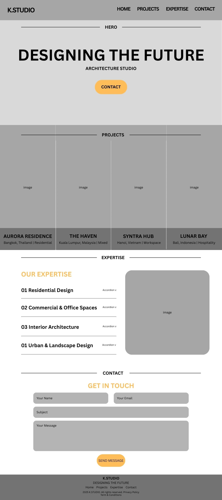
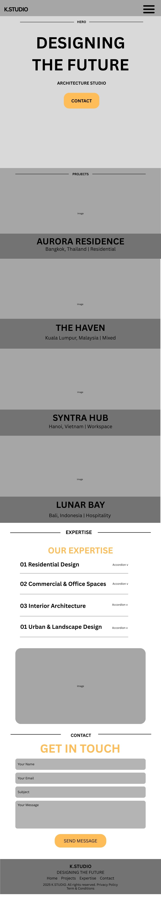

# K.Studio Architecture Firm Website

A modern, responsive, single-page architecture studio website built using HTML, CSS, and JavaScript. The website features smooth animations, interactive UI components, responsive layouts, and accessibility-focused design.

Developed as part of the **953104 – Interactive Website** course.

---

## Live Demo

(https://win-kk.github.io/kstudio-architecture-website/)

---

## Screenshots

### Desktop



### Mobile



> You can also add screenshots of the final website here.

---

# Features

## Responsive Navigation

- Fixed glassmorphism navigation bar
- Smooth scrolling between sections
- Mobile hamburger menu
- Animated hamburger icon

---

## Hero Section

- Full-screen hero banner
- Animated heading
- Ken Burns background zoom effect
- Responsive layout

---

## Project Showcase

- Four interactive project panels
- Hover expansion effect on desktop
- Grayscale transition for inactive panels
- Fully responsive vertical layout on mobile

---

## Expertise Section

- Interactive accordion interface
- Dynamic image switching
- Smooth expand/collapse animation
- Keyboard accessible

---

## Contact Form

- Client-side validation
- Name validation
- Email format validation
- Subject validation
- Message validation
- Loading button state
- Success and error notifications
- Form reset after successful submission

> **Note:** This project simulates form submission and does not send emails.

---

## Animations

- Animated preloader
- Hero entrance animation
- Ken Burns background animation
- Button hover effects
- Smooth transitions
- Notification animations

---

## Accessibility

- Semantic HTML
- Keyboard navigation
- Focus indicators
- ARIA labels
- Screen-reader friendly validation
- Responsive touch targets

---

## Responsive Design

### Desktop (>1024px)

- Horizontal project showcase
- Hover interactions
- Full navigation

### Tablet (769px–1024px)

- Hamburger menu
- Optimized spacing

### Mobile (<768px)

- Vertical layouts
- Touch-friendly controls
- Simplified interactions

---

# Technologies Used

- HTML5
- CSS3
- JavaScript (ES6)
- Flexbox
- CSS Grid
- CSS Animations
- Responsive Web Design

---

# Project Structure

```
.
├── index.html
├── style.css
├── script.js
├── README.md
│
├── showcase-images/
│   ├── ...
│
├── expertise-images/
│   ├── ...
│
├── ArchitectWebsite_wireframe_desktop.jpg
├── ArchitectWebsite_wireframe_mobile.jpg
└── hero.jpg
```

---

# Installation

Clone the repository.

```bash
git clone https://github.com/yourusername/kstudio-architecture-website.git
```

Open the project folder.

```bash
cd kstudio-architecture-website
```

Open `index.html` in your preferred web browser.

No additional installation or dependencies are required.

---

# How to Use

- Navigate using the navigation bar.
- Scroll through each section.
- Hover over project panels on desktop.
- Click expertise items to change descriptions and images.
- Submit the contact form to test validation.
- Resize the browser to view the responsive layouts.

---

# Skills Demonstrated

- Responsive Web Design
- HTML5 Semantic Structure
- CSS Animations
- CSS Flexbox
- CSS Grid
- JavaScript DOM Manipulation
- Event Handling
- Form Validation
- Accessibility (WCAG basics)
- Mobile-First Design
- UI/UX Principles

---

# Future Improvements

- Backend contact form using Spring Boot or Node.js
- Email integration
- Dark mode
- CMS integration
- Project filtering
- Lazy-loaded images
- Performance optimization
- SEO improvements

---

# Learning Outcomes

This project strengthened my understanding of:

- Responsive web development
- JavaScript interactivity
- Accessibility best practices
- UI animation techniques
- Component organization
- User experience design

---

# Author

**Win Khant Ko Ko**

GitHub: https://github.com/win-kk

---

# Academic Information

**Course:** 953104 – Interactive Website

This project was developed as a university term project to demonstrate responsive web development, accessibility, interactive JavaScript, and modern frontend design techniques.

---

# License

This project is intended for educational and portfolio purposes.
